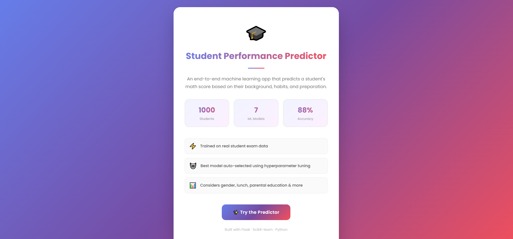

# 🎓 Student Exam Performance Predictor

An end-to-end machine learning web application that predicts a student's **math score** based on their demographic background, parental education, lunch type, and test preparation status.

---

## 📸 Screenshots




---

## 📌 Problem Statement

Understanding how various factors affect student performance is critical for educators and policymakers. This project explores how variables such as **gender, ethnicity, parental level of education, lunch type, and test preparation course** influence student exam scores — and builds a predictive model to estimate math scores.

---

## 🗂️ Project Structure

```
mlproject/
├── artifacts/               # Saved model and preprocessor files
├── catboost_info/           # CatBoost training logs
├── logs/                    # Application logs
├── notebook/
│   ├── data/
│   │   └── stud.csv         # Raw dataset
│   ├── 1. EDA.ipynb         # Exploratory Data Analysis
│   └── 2. MODEL TRAINING.ipynb
├── src/
│   ├── components/
│   │   ├── data_ingestion.py
│   │   ├── data_transformation.py
│   │   └── model_trainer.py
│   ├── pipeline/
│   │   └── predict_pipeline.py
│   ├── exception.py
│   ├── logger.py
│   └── utils.py
├── templates/
│   ├── index.html           # Landing page
│   └── home.html            # Prediction form
├── app.py                   # Flask web application
├── setup.py
└── requirements.txt
```

---

## 📊 Dataset

- **Source**: [Kaggle - Students Performance in Exams](https://www.kaggle.com/datasets/spscientist/students-performance-in-exams)
- **Rows**: 1000 students
- **Columns**: 8 features

| Feature | Description |
|---------|-------------|
| gender | Male / Female |
| race_ethnicity | Group A to Group E |
| parental_level_of_education | Highest education of parent |
| lunch | Standard or Free/Reduced |
| test_preparation_course | Completed or None |
| math_score | Target variable |
| reading_score | Input feature |
| writing_score | Input feature |

---

## 🔍 Exploratory Data Analysis

Key findings from EDA:
- ✅ No missing values in the dataset
- 📈 Students with **standard lunch** consistently score higher
- 📚 **Completed test preparation** improves scores across all subjects
- 👨‍👩‍🎓 **Parental education level** positively correlates with student performance
- 🏆 **Group E** students have the highest average scores
- 📉 Math, reading and writing scores are strongly correlated with each other

---

## ⚙️ ML Pipeline

### 1. Data Ingestion
- Reads raw CSV data
- Splits into train (80%) and test (20%) sets
- Saves to `artifacts/` folder

### 2. Data Transformation
- **Numerical features**: Median imputation + Standard Scaling
- **Categorical features**: Most frequent imputation + One Hot Encoding + Standard Scaling
- Preprocessor saved as `preprocessor.pkl`

### 3. Model Training
The following models were trained and evaluated using **GridSearchCV** for hyperparameter tuning:

| Model | Notes |
|-------|-------|
| Linear Regression | Baseline model |
| Decision Tree | With criterion tuning |
| Random Forest | With n_estimators tuning |
| Gradient Boosting | With learning rate & subsample tuning |
| XGBoost | With learning rate tuning |
| CatBoost | With depth & iterations tuning |
| AdaBoost | With learning rate tuning |

- Best model automatically selected based on **R² score**
- Saved as `model.pkl`

---

## 🌐 Web Application

Built with **Flask**, the app allows users to input student details and get an instant math score prediction.

### Run locally:

```bash
# Clone the repository
git clone https://github.com/yourusername/mlproject.git
cd mlproject

# Create virtual environment
conda create -p venv python==3.8 -y
conda activate venv/

# Install dependencies
pip install -r requirements.txt

# Run the app
python app.py
```

Then visit: `http://127.0.0.1:5000`

---

## 🛠️ Tech Stack

| Tool | Purpose |
|------|---------|
| Python 3.8 | Core language |
| Pandas & NumPy | Data manipulation |
| Scikit-learn | ML models & preprocessing |
| XGBoost & CatBoost | Boosting algorithms |
| Flask | Web framework |
| Seaborn & Matplotlib | Data visualization |
| Git & GitHub | Version control |

---

## 👩‍💻 Author

**Isha Mumtaz**
- 📧 Ishamumtazet@gmail.com

---

## 📄 License

This project is open source and available under the [MIT License](LICENSE).